<!-- 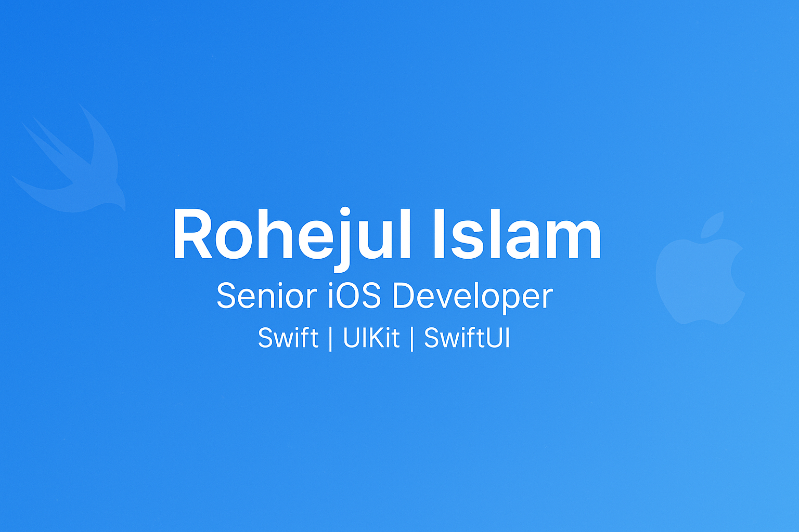 -->

## About Me

Design-orientedand collaborative iOS developer with 5 yearsof experience building high-quality apps usingSwift,
Objective-C, UIKit and SwiftUI. Skilled in applying design patterns (MVVM, MVVM-C, MVC), clean code principles
and testing frameworks including XCTest and XCUITest to deliver scalable and maintainable solutions. Also familiar
with native Android app development using Kotlin and cross-app development using Flutter.

Feel free to explore my projects, provide feedback, and connect with me for any potential collaborations

&nbsp

# Projects

## Deltapath Mobile &nbsp;<a href="https://apps.apple.com/us/app/deltapath-mobile/id1193951504">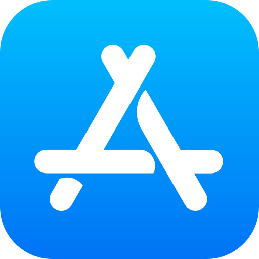</a>

<!-- <h2>
  
    Deltapath &nbsp;
    
  
</h2> -->

Deltapath Mobile is a next-generation business communication app designed to support your daily workflow. With real-time messaging, push-to-talk functionality, live video calls, file sharing, and task coordination—all in one platform—it empowers teams to collaborate seamlessly and stay connected on the go.

 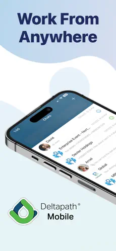
 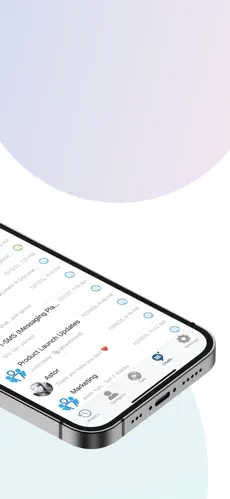
 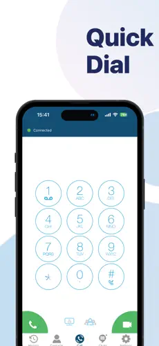
 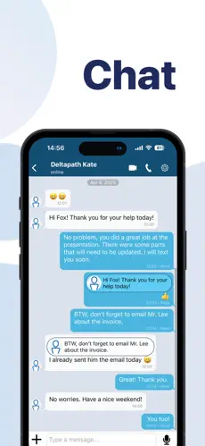
 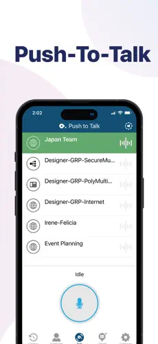

**Tech Used:**

- Swift
- Objective-C
- UIKit
- SwiftUI
- Callkit
- PushKit
- Core Data
- XMPPFramework

## PBN Grow &nbsp;

PbN Grow is a powerful mobile tool for dental practices, providing 24/7 access to essential features like patient messaging, missed call alerts, actionable analytics, and schedule management — all designed to keep your practice running smoothly on the go.

 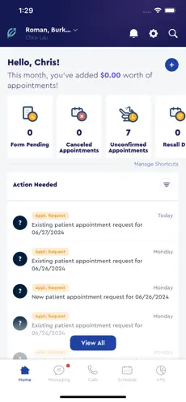
 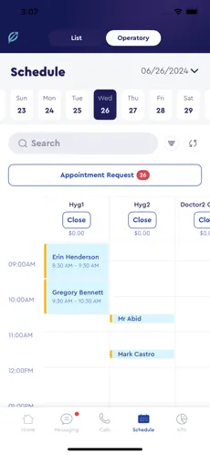
 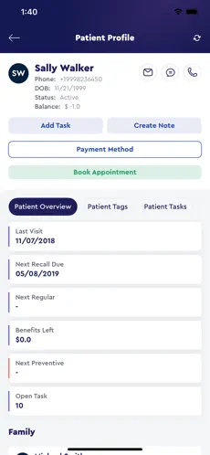
 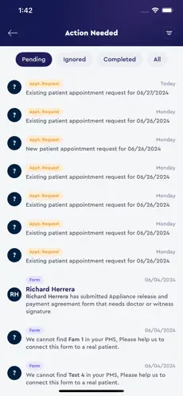

**Tech Used:**

- Swift
- UIKit
- SwiftUI
- MessageKit
- CallKit
- Combine

## CelebYou - Talent Challenge

 <!-- &nbsp; -->

CelebYou provides unique and exciting real world experiences for everyone and anyone that loves the arts, entertainment, athletics, design and more. Challenge yourself to showcase your talents and win prizes.

 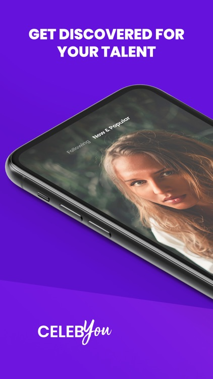
 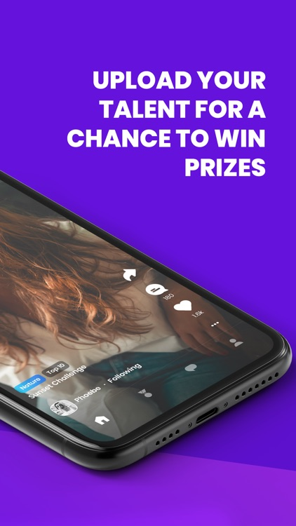
 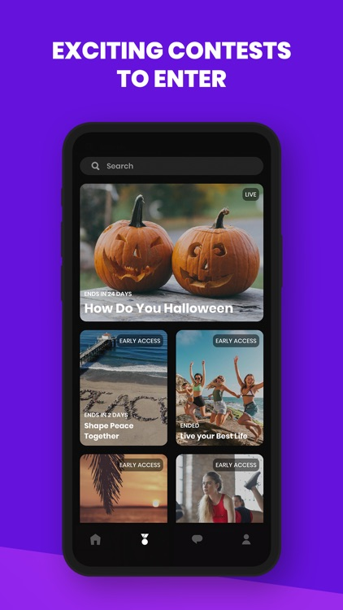
 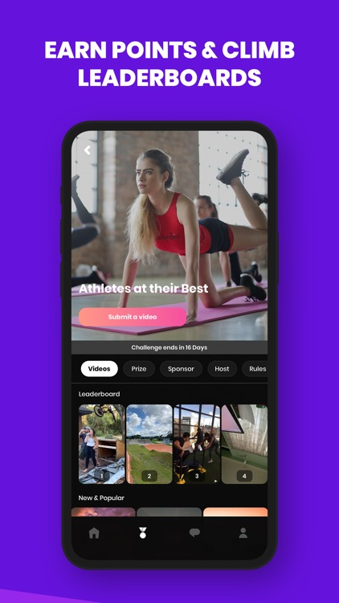

**Tech Used:**

- Swift
- UIKit
- AVFoundation
- Amplify-swift
- SkeletonView
- SDWebImage

## Wanderdriven &nbsp;

Wanderdriven is a location based app that takes you an unexpected journey of discovery. From famous locations to off the beaten path each palce has a story to tell. Wanderdriven is about to exploring the stories & people of the world.

 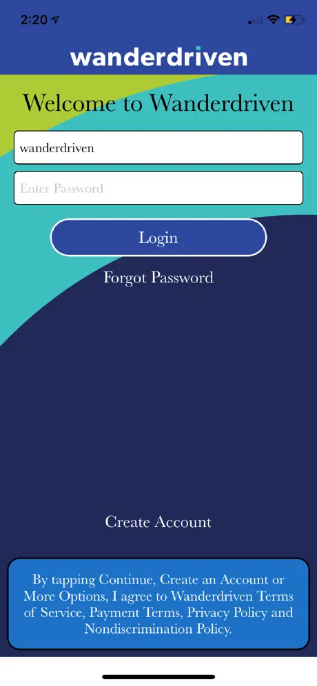
 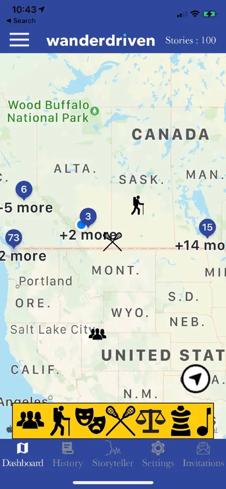
 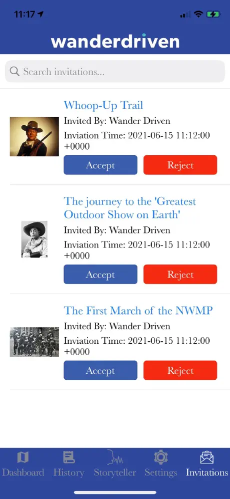

**Tech Used:**

- Swift
- UIKit
- MapKit
- Core Location
- Speech
- UserNotifications

## কুরআনের ভাষা &nbsp;

Quran er Bhasha is designed for those of us (Bangladeshi) who can read Arabic but struggle to understand its meaning—especially the words we recite in our daily prayers. Many people long to understand the Qur'an but don’t have the time or opportunity to study Arabic grammar.

 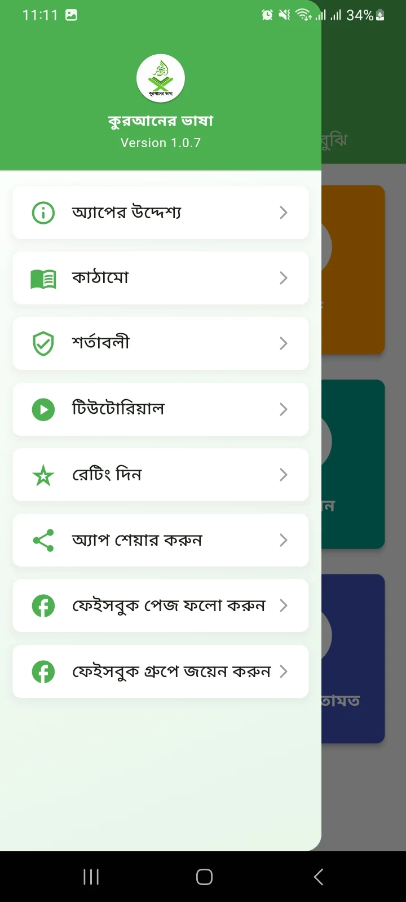
 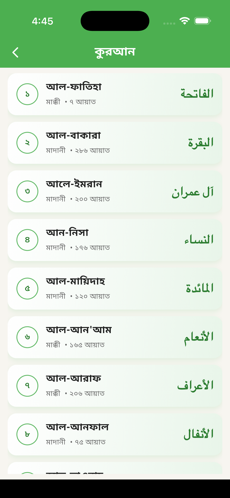
 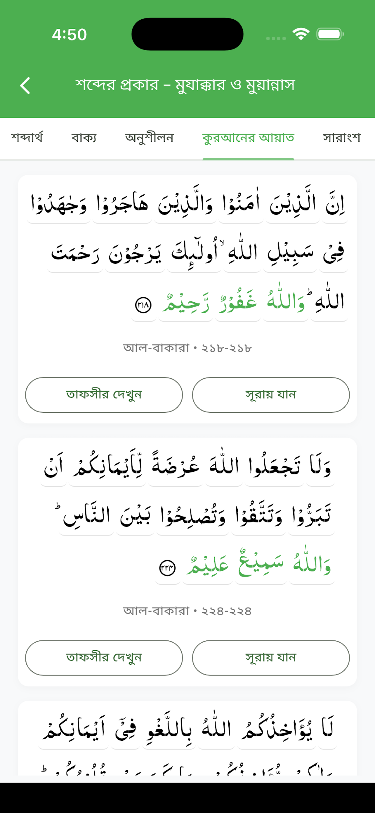
 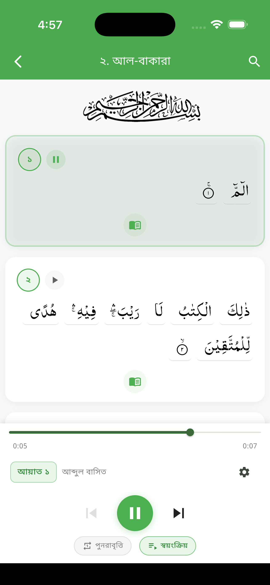

**Tech Used:**

- Fluter
- Firebase
- Sqflite (SQLite plugin)
